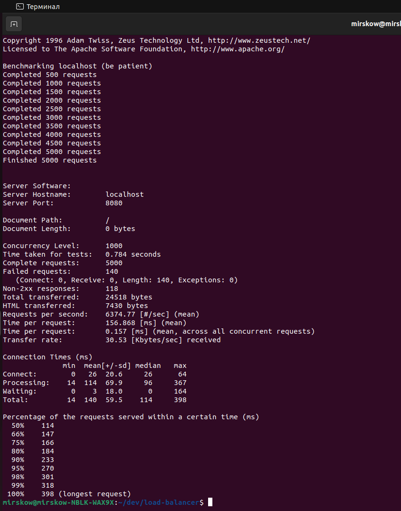

Load-Balancer with Rate Limiting (Golang)

Проект представляет собой HTTP-балансировщик нагрузки на Go с распределением запросов между backend-серверами по алгоритму Round Robin и встроенным rate limiting на основе алгоритма Token Bucket. Балансировщик автоматически отслеживает состояние backend-ов, перенаправляет трафик только на здоровые инстансы и ограничивает частоту запросов для защиты инфраструктуры от перегрузки.

### Сборка и запуск
#### Зависимости
- Go 1.23
- Redis 7
- Docker & Docker-compose
- Lua (для атомарности с Redis)

#### Для запуска приложения:
1. Используйте следующие команды для сборки и запуска проекта:
```
make build && make run
```
После этого балансировщик будет доступен на порту `:8080`. Бекенды будут доступны по адресам:
- http://localhost:8081
- http://localhost:8082
- http://localhost:8083

2. Интеграционные тесты запускаются командой:
```
make test
```
3. Для остановки и удаления запущенных контейнеров можно использовать команды соответственно:
```
make stop && make down
```

Все параметры (порты, лимиты, адреса backend-ов, настройки Redis и лимитера) задаются в YAML-файле конфигурации.

#### Нагрузочное тестирование проекта

Проект протестирован с помощью ApacheBench (ab) при высокой параллельной нагрузке.
Пример команды для тестирования:
```
ab -n 5000 -c 1000 http://localhost:8080/
```

Результаты теста (см. скриншот ниже) показывают устойчивость балансировщика при обработке тысяч одновременных запросов.


